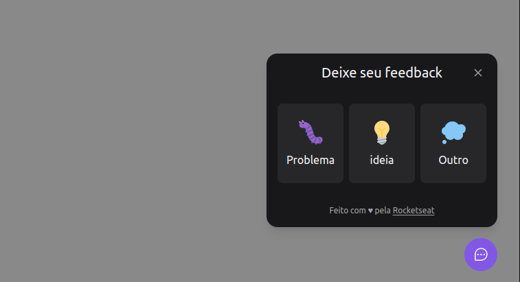
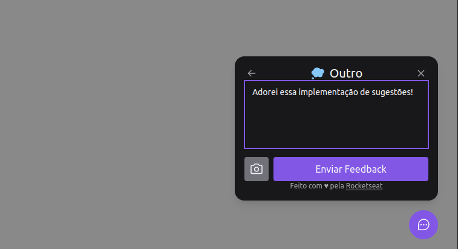
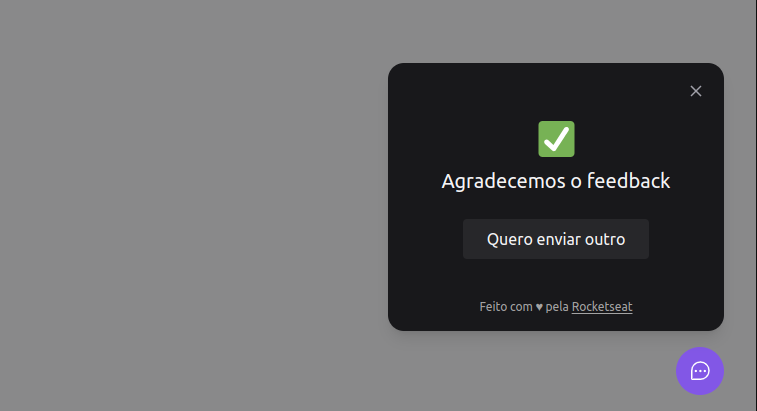

<h1 align="center">  Feedback Suggested </h1>

<p align="center">
O projeto foi desenvolvido em conjunto com a escola <a href="https://www.rocketseat.com.br/" target="_blank">Rocketseat</a>, um widget que recolhe e reporta bugs, ideias e comentários dos usuários.
</p>

<p align="center">
  
</p>

<h2 align="center"> 🚀 Veja a  <a href="https://feedback-suggested.vercel.app/" target="_blank">aplicação no ar 🚀 </a></h2>
<br>

## 🟣 Tecnologias utilizadas:

### frontend:

- ReactJS
- ViteJS
- TypeScript
- Tailwind CSS
- Axios
- Phosphor react

### backend:

- NodeJS
- Express
- TypeScript
- Jest
- Nodemailer
- Prisma
- Postgresql
- Mailtrap

### mobile:

- React Native
- TypeScript
- Expo
- Bottom sheet
- Axios
- Phosphor React Native
- Gesture handler
<br>

## 🟣 Como rodar

```bash
$ Observação: Para testar precisa server e web estarem rodando juntos, assim como server e mobile.
```
#### Web

```bash
# Instalar dependencias
$ cd web
$ npm install

# Executar o projeto
$ npm run dev
```

#### Server

```bash
# Instalar dependencias
$ cd server
$ npm install

# Executar o projeto
$ npx prisma migrate deploy
$ npm run dev
$ npx prisma studio

```

#### Mobile

```bash
# Instalar dependencias
$ cd mobile
$ npm install

# Executar o projeto
$ npx expo start

$ Observação: dentro da pasta mobile/lib, dentro do arquivo api.ts adicione:
`
import axios from "axios";

export const api = axios.create({
  baseURL: 'http://000.000.000.0:3333'
})
`
* Precisa adicionar o seu IP na 'baseURL:http://000.000.000.0:3333' estará disponivel  abaixo do QR code ao executar o projeto *
```
<br>

## 🟣 Testar a requisição HTTP

```bash
# Instale o postman 
(https://www.postman.com/)

# Faça a requisição:

POST: http://localhost:3333/feedbacks
 body:{
    "type": "BUGs",
    "comment": "bugou geral!!!"
 }
```
